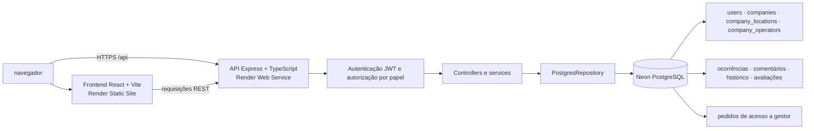
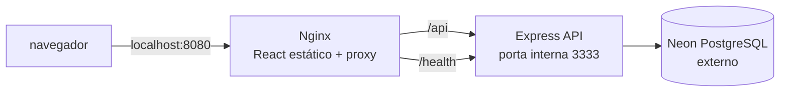
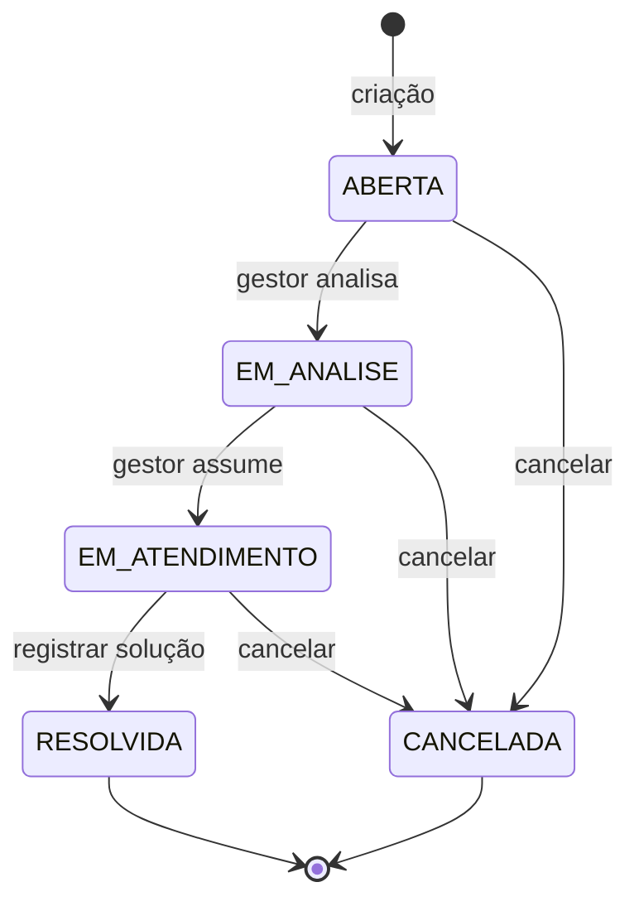

# ResolveAi

Sistema web de gestão de ocorrências com cadastro de solicitantes, acompanhamento de status, comentários, avaliações e aprovação administrativa para acesso de gestores.

**Desenvolvido por:** Johnatan Oliveira Santos · **RM:** RM369240  
**Repositório GitHub:** [github.com/JohnatanOliv/ResolveAi---Project](https://github.com/JohnatanOliv/ResolveAi---Project)
**Aplicação publicada:** [https://resolveai-di8l.onrender.com](https://resolveai-di8l.onrender.com)

> Na instância gratuita do Render, o serviço pode suspender após um período sem uso. A primeira abertura depois disso pode levar alguns instantes enquanto a aplicação inicia.

## Arquitetura

### Aplicação publicada no Render



O frontend e a API são serviços separados no Render. O navegador chama a URL pública da API; a API conecta-se ao Neon por `DATABASE_URL`. O banco não é incluído nas imagens Docker.

### Execução local com Docker Compose



Nessa configuração, o Nginx serve o frontend e encaminha `/api` para a API pela rede privada do Compose. O serviço API usa a mesma `DATABASE_URL` do Neon.

## Funcionalidades

- Cadastro e autenticação com senha protegida por bcrypt e sessão JWT.
- Cadastro público sempre cria o papel `SOLICITANTE`.
- Criação e acompanhamento de ocorrências, anexos de imagem, filtros por categoria/status/prioridade, comentários, histórico, avaliações e indicadores.
- Gestores cadastram empresas com apenas um nome e adicionam os prédios/unidades com nome curto e endereço; solicitantes escolhem empresa e local ao abrir ocorrência.
- Gestores cadastram operadores de manutenção (nome e telefone opcional, sem conta/login) por empresa e os atribuem às ocorrências dessa empresa.
- Categorias comuns oferecem descrições pré-definidas, deixando texto adicional opcional e entrada livre somente para "Outro problema".
- Gestores e administradores podem atribuir um operador de manutenção da empresa, alterar prioridade/status e registrar solução com observação auditável.
- Solicitantes podem pedir acesso de gestor; somente um usuário `ADMIN` pode aprovar ou recusar esses pedidos.
- Aprovar um pedido promove a conta para `GESTOR`; o fluxo não oferece promoção pública para `ADMIN`.

### Ciclo de vida da ocorrência



Cada criação e transição registra status anterior/novo, data, usuário responsável e observação no histórico.

## Tecnologias

- Frontend: React, TypeScript, Vite e Lucide.
- Backend: Node.js, Express, TypeScript, bcrypt e JWT.
- Banco de dados: PostgreSQL gerenciado pelo Neon.
- Publicação atual: frontend estático e API separados no Render.
- Contêineres locais: Docker Compose, Nginx e API Node.

## Requisitos

- Node.js 22 ou superior e npm.
- Docker Desktop com Docker Compose, para a execução em contêineres.
- Projeto PostgreSQL no Neon e uma connection string válida.

## Banco de dados

Para um banco Neon novo, execute `database/02_schema.postgres.sql` no SQL Editor do Neon.

Para um banco Neon existente, aplique as migrations nesta ordem: `database/03_manager_access_migration.sql` (papéis e aprovação de gestores), `database/04_occurrence_image_text.sql` (imagem e preenchimento de histórico inicial), `database/05_companies_locations.sql` (empresas e prédios) e `database/06_company_operators.sql` (contatos operadores e atribuição por empresa). Não execute o schema SQL Server `database/01_schema.sql` no Neon.

O anexo atual aceita PNG, JPEG ou WebP de até 1 MB e é guardado como data URL no PostgreSQL. Esse caminho mantém o MVP autocontido; para volume maior, substitua por object storage e guarde no banco somente a URL do objeto. A migration `04_occurrence_image_text.sql` deve ser aplicada no Neon antes de publicar a nova versão.

Cada empresa pertence ao gestor que a cadastrou. Solicitantes autenticados podem consultar nomes de empresas e endereços ativos; gestores só veem e atualizam ocorrências das próprias empresas e só administram seus endereços e operadores, enquanto ADMIN tem visão e administração globais. Para cadastrar endereços e operadores, acesse **Empresas** no painel do gestor.

Operadores são contatos de manutenção, não usuários do sistema: têm nome e telefone opcional, não recebem credenciais e não entram no fluxo de autorização. A atribuição é validada para que o operador pertença à mesma empresa da ocorrência.

Ocorrências criadas antes da migration `05_companies_locations.sql` ficam sem `company_id` e `location_id`: elas continuam visíveis ao solicitante e ao ADMIN, mas não aparecem na fila de gestores até o ADMIN vinculá-las manualmente a uma empresa/endereço.

No cadastro de ocorrência, o solicitante seleciona uma empresa, depois um endereço dessa empresa e então escolhe um problema comum prefixado pela categoria. Texto livre fica opcional; só "Outro problema" pede título livre. Operadores são contatos com nome e telefone opcional, sem login. Gestores veem ocorrências das próprias empresas; ADMIN tem visão global. Ocorrências anteriores à migration `05_companies_locations.sql` ficam sem empresa e requerem classificação pelo ADMIN para entrar na fila de um gestor.

O cabeçalho mostra nome e perfil, com saída no topo; no modo escuro o wordmark vira apenas o ícone da marca e o sino de notificação não é exibido.

O primeiro administrador deve ser promovido manualmente no Neon, depois que a conta tiver sido cadastrada e o endereço confirmado. Substitua o e-mail pelo da conta correta:

```sql
UPDATE users
SET role = 'ADMIN', updated_at = NOW()
WHERE lower(email) = lower('seu-email@exemplo.com')
RETURNING id, name, email, role;
```

Confira a linha retornada antes de continuar. Não compartilhe a `DATABASE_URL`, porque ela contém credenciais.

## Testes e builds

Os testes do backend verificam o cadastro público, regras dos pedidos de acesso e autorização administrativa:

```powershell
Set-Location backend
npm ci
npm test
npm run build
```

Para validar o frontend:

```powershell
Set-Location frontend
npm ci
npm run build
```

O build Docker da API executa `npm test` e `npm run build` antes de gerar a imagem de runtime.

## Desenvolvimento local sem Docker

Terminal 1, API:

```powershell
Set-Location backend
npm ci
$env:DATABASE_URL = "sua-connection-string-do-neon"
$env:JWT_SECRET = "um-segredo-local-longo-e-aleatorio"
npm run dev
```

Terminal 2, frontend:

```powershell
Set-Location frontend
npm ci
$env:VITE_API_URL = "http://localhost:3333/api"
npm run dev
```

Abra `http://localhost:5173`. O backend fica em `http://localhost:3333`; o health check é `http://localhost:3333/health`.

## Executar com Docker Compose

Na raiz do repositório, copie o modelo de ambiente e edite `.env` com os valores do seu Neon:

```powershell
Copy-Item .env.example .env
```

Preencha `DATABASE_URL` com a connection string do Neon e `JWT_SECRET` com um segredo aleatório forte. O arquivo `.env` é ignorado pelo Git e pelo Docker.

Suba os serviços:

```powershell
docker compose up --build -d
```

Acesse `http://localhost:8080`. Confirme a API em `http://localhost:8080/health` e o Nginx em `http://localhost:8080/healthz`.

Comandos úteis:

```powershell
docker compose ps
docker compose logs -f api web
docker compose down
```

Para construir imagens separadas manualmente:

```powershell
docker build --target api -t resolveai-api .
docker build --target web -t resolveai-web .
```

## Publicação no Render

### Backend

- Root Directory: `backend`
- Build Command: `npm ci --include=dev && npm test && npm run build`
- Start Command: `npm start`
- Variáveis: `DATABASE_URL`, `JWT_SECRET` e `NODE_ENV=production`

### Frontend

- Root Directory: `frontend`
- Build Command: `npm ci && npm run build`
- Publish Directory: `dist`
- Variável de build `VITE_API_URL`: URL pública do backend terminando em `/api`, por exemplo `https://seu-backend.onrender.com/api`.

Depois de alterar variáveis Vite, faça um novo deploy do frontend. Valores `VITE_*` são incorporados ao bundle durante o build.

## Papéis

| Papel | Permissões |
|---|---|
| `SOLICITANTE` | Criar e acompanhar as próprias ocorrências; solicitar acesso de gestor. |
| `GESTOR` | Administrar as próprias empresas, cadastrar endereços e operadores, e atender ocorrências dessas empresas. |
| `ADMIN` | Visão global; pode administrar empresas e atender qualquer ocorrência, além de analisar pedidos de acesso. |

A autorização é aplicada pelo backend; ocultar opções no frontend não substitui as verificações nas rotas.
